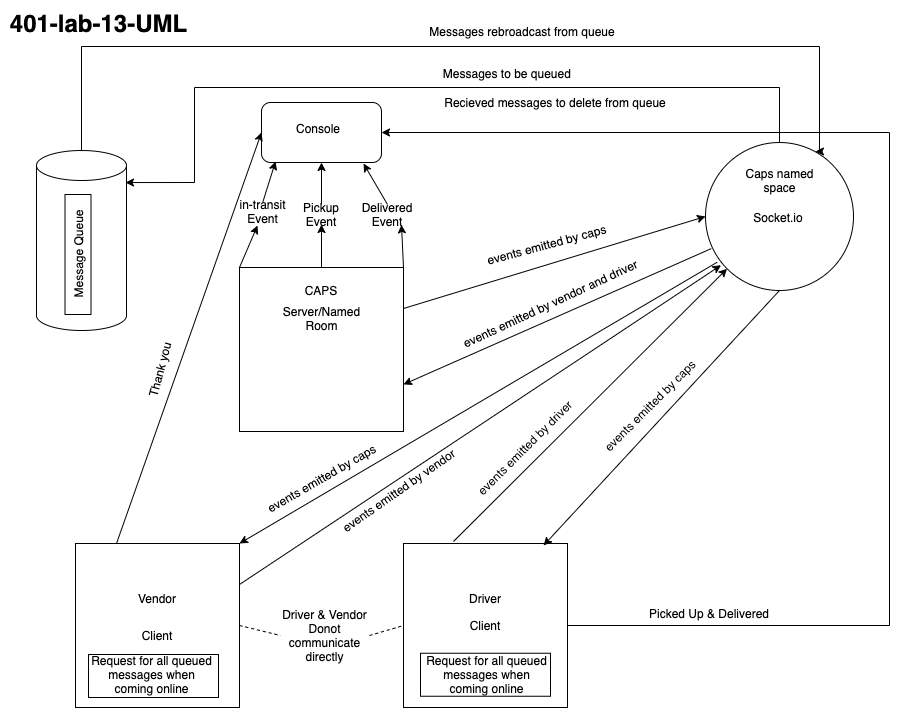

# caps

## UML 

## npm start
CONNECTED to queue-server FVX5OhDsH2HK_IGuAAAB
get all the Queue
CONNECTED to queue-server PW609VOwqCesz5nxAAAD
EVENT: {
  event: 'pickup',
  time: '11/17/2021, 12:16:17 AM',
  payload: {
    store: '1-206-flowers',
    orderID: 'e590dae7-af70-4f66-bd80-9af2b59a5ed7',
    customer: 'Mr. James Marquardt',
    address: '3398 Strosin Passage'
  }
}
Driver: picked up undefined
after adding task Msg Q >> {
  Queue: {
    '6901288c-13b0-4499-880e-9859f79ca350': {
      store: '1-206-flowers',
      orderID: 'e590dae7-af70-4f66-bd80-9af2b59a5ed7',
      customer: 'Mr. James Marquardt',
      address: '3398 Strosin Passage'
    }
  }
}
after deleting the task from Msg Q >> {
  Queue: {
    '6901288c-13b0-4499-880e-9859f79ca350': {
      store: '1-206-flowers',
      orderID: 'e590dae7-af70-4f66-bd80-9af2b59a5ed7',
      customer: 'Mr. James Marquardt',
      address: '3398 Strosin Passage'
    }
  }
}
EVENT: {
  event: 'in-transit',
  time: '11/17/2021, 12:16:17 AM',
  payload: {
    store: '1-206-flowers',
    orderID: 'e590dae7-af70-4f66-bd80-9af2b59a5ed7',
    customer: 'Mr. James Marquardt',
    address: '3398 Strosin Passage'
  }
}
EVENT: {
  event: 'delivered',
  time: '11/17/2021, 12:16:17 AM',
  payload: {
    store: '1-206-flowers',
    orderID: 'e590dae7-af70-4f66-bd80-9af2b59a5ed7',
    customer: 'Mr. James Marquardt',
    address: '3398 Strosin Passage'
  }
}
EVENT: {
  event: 'pickup',
  time: '11/17/2021, 12:16:17 AM',
  payload: {
    store: '1-206-flowers',
    orderID: 'adb6f9ed-83f3-4cca-8115-75c1645bcbea',
    customer: 'Mr. Renee Kiehn',
    address: '5132 Ezra Corner'
  }
}
Driver: picked up undefined
after adding task Msg Q >> {
  Queue: {
    '6901288c-13b0-4499-880e-9859f79ca350': {
      store: '1-206-flowers',
      orderID: 'e590dae7-af70-4f66-bd80-9af2b59a5ed7',
      customer: 'Mr. James Marquardt',
      address: '3398 Strosin Passage'
    },
    '74547a1c-f3f3-4028-993d-c0acc1b65dec': {
      store: '1-206-flowers',
      orderID: 'adb6f9ed-83f3-4cca-8115-75c1645bcbea',
      customer: 'Mr. Renee Kiehn',
      address: '5132 Ezra Corner'
    }
  }
}
after deleting the task from Msg Q >> {
  Queue: {
    '6901288c-13b0-4499-880e-9859f79ca350': {
      store: '1-206-flowers',
      orderID: 'e590dae7-af70-4f66-bd80-9af2b59a5ed7',
      customer: 'Mr. James Marquardt',
      address: '3398 Strosin Passage'
    },
    '74547a1c-f3f3-4028-993d-c0acc1b65dec': {
      store: '1-206-flowers',
      orderID: 'adb6f9ed-83f3-4cca-8115-75c1645bcbea',
      customer: 'Mr. Renee Kiehn',
      address: '5132 Ezra Corner'
    }
  }
}
EVENT: {
  event: 'in-transit',
  time: '11/17/2021, 12:16:17 AM',
  payload: {
    store: '1-206-flowers',
    orderID: 'adb6f9ed-83f3-4cca-8115-75c1645bcbea',
    customer: 'Mr. Renee Kiehn',
    address: '5132 Ezra Corner'
  }
}
EVENT: {
  event: 'delivered',
  time: '11/17/2021, 12:16:17 AM',
  payload: {
    store: '1-206-flowers',
    orderID: 'adb6f9ed-83f3-4cca-8115-75c1645bcbea',
    customer: 'Mr. Renee Kiehn',
    address: '5132 Ezra Corner'
  }
}
EVENT: {
  event: 'pickup',
  time: '11/17/2021, 12:16:17 AM',
  payload: {
    store: '1-206-flowers',
    orderID: '1759beaf-2eb8-4812-8e74-acb02e1985f8',
    customer: 'Jodi Grady',
    address: '7070 Tyreek Glens'
  }
}
Driver: picked up undefined
after adding task Msg Q >> {
  Queue: {
    '6901288c-13b0-4499-880e-9859f79ca350': {
      store: '1-206-flowers',
      orderID: 'e590dae7-af70-4f66-bd80-9af2b59a5ed7',
      customer: 'Mr. James Marquardt',
      address: '3398 Strosin Passage'
    },
    '74547a1c-f3f3-4028-993d-c0acc1b65dec': {
      store: '1-206-flowers',
      orderID: 'adb6f9ed-83f3-4cca-8115-75c1645bcbea',
      customer: 'Mr. Renee Kiehn',
      address: '5132 Ezra Corner'
    },
    '282d9d35-054d-4d9f-8885-fba22b57d019': {
      store: '1-206-flowers',
      orderID: '1759beaf-2eb8-4812-8e74-acb02e1985f8',
      customer: 'Jodi Grady',
      address: '7070 Tyreek Glens'
    }
  }
}
after deleting the task from Msg Q >> {
  Queue: {
    '6901288c-13b0-4499-880e-9859f79ca350': {
      store: '1-206-flowers',
      orderID: 'e590dae7-af70-4f66-bd80-9af2b59a5ed7',
      customer: 'Mr. James Marquardt',
      address: '3398 Strosin Passage'
    },
    '74547a1c-f3f3-4028-993d-c0acc1b65dec': {
      store: '1-206-flowers',
      orderID: 'adb6f9ed-83f3-4cca-8115-75c1645bcbea',
      customer: 'Mr. Renee Kiehn',
      address: '5132 Ezra Corner'
    },
    '282d9d35-054d-4d9f-8885-fba22b57d019': {
      store: '1-206-flowers',
      orderID: '1759beaf-2eb8-4812-8e74-acb02e1985f8',
      customer: 'Jodi Grady',
      address: '7070 Tyreek Glens'
    }
  }
}
EVENT: {
  event: 'in-transit',
  time: '11/17/2021, 12:16:17 AM',
  payload: {
    store: '1-206-flowers',
    orderID: '1759beaf-2eb8-4812-8e74-acb02e1985f8',
    customer: 'Jodi Grady',
    address: '7070 Tyreek Glens'
  }
}
EVENT: {
  event: 'delivered',
  time: '11/17/2021, 12:16:17 AM',
  payload: {
    store: '1-206-flowers',
    orderID: '1759beaf-2eb8-4812-8e74-acb02e1985f8',
    customer: 'Jodi Grady',
    address: '7070 Tyreek Glens'
  }
}
## node driver.js
DRIVER: will get the order :e590dae7-af70-4f66-bd80-9af2b59a5ed7
DRIVER: picked up e590dae7-af70-4f66-bd80-9af2b59a5ed7
DRIVER: delivered up e590dae7-af70-4f66-bd80-9af2b59a5ed7
DRIVER: will get the order :adb6f9ed-83f3-4cca-8115-75c1645bcbea
DRIVER: picked up adb6f9ed-83f3-4cca-8115-75c1645bcbea
DRIVER: delivered up adb6f9ed-83f3-4cca-8115-75c1645bcbea
DRIVER: will get the order :1759beaf-2eb8-4812-8e74-acb02e1985f8
DRIVER: picked up 1759beaf-2eb8-4812-8e74-acb02e1985f8
DRIVER: delivered up 1759beaf-2eb8-4812-8e74-acb02e1985f8

## node vendor.js (Two Vendor Choose One)
VENDOR: Order in Queue : a87e8aaf-3742-4ab3-b162-8206518c3bdd
 VENDOR: Thank you for delivering  a87e8aaf-3742-4ab3-b162-8206518c3bdd
VENDOR: Order in Queue : 774cd946-2d16-4365-aec2-c22670d9c442
 VENDOR: Thank you for delivering  774cd946-2d16-4365-aec2-c22670d9c442
VENDOR: Order in Queue : b40017ca-d617-4e5b-99ba-ed41f2d9b4a2
 VENDOR: Thank you for delivering  b40017ca-d617-4e5b-99ba-ed41f2d9b4a2
VENDOR: Order in Queue : ee343e50-92ee-434b-b516-0da10aaf3f14
 VENDOR: Thank you for delivering  ee343e50-92ee-434b-b516-0da10aaf3f14